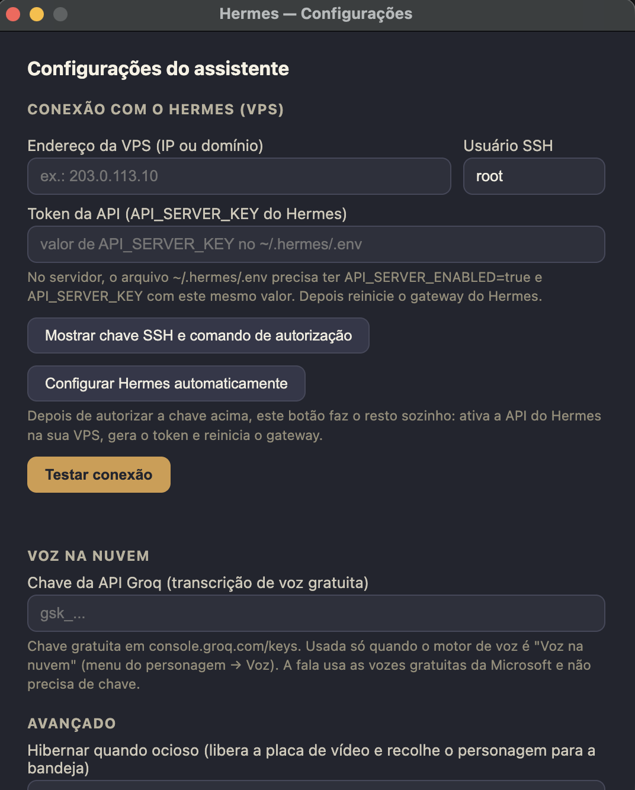

# Hermes Desktop — seu Hermes Agent com um rosto

Um assistente de mesa para Windows e macOS no espírito do velho Clippy, reestilizado: um
personagem com olhos grandes que flutua sobre as suas janelas, ouve você pelo microfone,
responde por voz e usa como cérebro o **seu próprio [Hermes Agent](https://github.com/nousresearch/hermes-agent)**
rodando na **sua VPS** — mesma memória e personalidade que você já tem no Telegram.

<p align="center">
  
  
</p>

## O que você precisa

1. **Windows 10/11 ou macOS**
2. **Um Hermes Agent funcionando na sua VPS** (com gateway ativo). Se ainda não tem,
   siga a doc oficial do Hermes primeiro.
3. Microfone (para falar) — ou use a caixinha de texto.

## Instalação

**Caminho 1 — com um agente (recomendado).** Clone este repositório, abra a pasta no
Claude Code (ou outro agente compatível) e diga: *"instala e configura o assistente para
mim"*. O arquivo `CLAUDE.md` ensina o agente a fazer tudo: instalar, conectar na sua VPS
e, se você tiver GPU NVIDIA, instalar a voz de alta qualidade.

**Caminho 2 — manual.**
1. Baixe o instalador na aba [Releases](../../releases) e execute. O app não é assinado
   digitalmente:
   - **Windows** avisa "editor desconhecido" — clique em "Mais informações → Executar
     assim mesmo".
   - **macOS** (baixe o `.dmg`): na primeira abertura, clique com o botão direito no app
     → **Abrir** → Abrir (o Gatekeeper bloqueia o duplo clique comum).
2. O personagem aparece na tela e, no primeiro uso, abre as **Configurações** sozinho
   (depois: botão direito no personagem → Configurações…).
3. Preencha o **IP da sua VPS** e o usuário SSH (geralmente `root`).
4. Clique em **"Mostrar chave SSH e comando de autorização"**, copie o comando e cole no
   terminal da sua VPS (uma única vez).
5. Clique em **"Configurar Hermes automaticamente"** — o app ativa a API do seu Hermes,
   gera o token e reinicia o gateway sozinho.
6. Clique em **"Testar conexão"**. Pronto: clique no personagem (ou `Ctrl+Alt+Space`) e fale.

## Voz

- **Voz leve (local)**: transcrição com whisper.cpp em CPU e resposta com a voz nativa
  do sistema. Nada de nuvem — o áudio nunca sai do seu computador. No Windows o app baixa
  o whisper.cpp sozinho (~190 MB); no macOS instale antes com `brew install whisper-cpp`.
- **Voz na nuvem (zero GPU)**: transcrição via Groq (chave gratuita) e fala via Edge TTS.
  Preencha a chave da Groq nas Configurações.
- **Voz completa (local, XTTS v2)**: vozes neurais muito mais naturais (8 opções,
  incluindo graves). No Windows com GPU NVIDIA: rode `instalar-voz.ps1` (PowerShell).
  No macOS (Apple Silicon roda em CPU mais rápido que o tempo real):
  ```bash
  cd voice-server
  uv venv --python 3.11 .venv
  uv pip install --python .venv torch torchaudio
  uv pip install --python .venv -r requirements.txt "coqui-tts[codec]"
  ```
  e aponte a "Pasta do servidor de voz" (Configurações) para a pasta `voice-server`.
- **Só texto**: menu Voz → "Só texto".

## O que ele faz

Personagem animado que segue seu mouse com os olhos • conversa por voz ou texto •
personalidades (Cavaleiro épico-cômico ou assistente direto) • 6 cores, 3 tamanhos •
histórico de conversas • avisos proativos do seu Hermes • modo reduzido automático com
OBS aberto e some em tela cheia (Windows) • hibernação da GPU configurável.

## Privacidade e segurança

- Nas vozes locais (leve e completa), transcrição e síntese não saem do seu computador;
  na voz na nuvem, o áudio passa pela Groq e pelo Edge TTS.
- A conexão com a sua VPS é um **túnel SSH** com chave dedicada — a API do Hermes nunca
  fica exposta na internet.
- O app guarda configurações em `%APPDATA%\hermes-assistente` (Windows) ou
  `~/Library/Application Support/hermes-assistente` (macOS) e nada mais.

## Licença

MIT — use, modifique e distribua à vontade.
